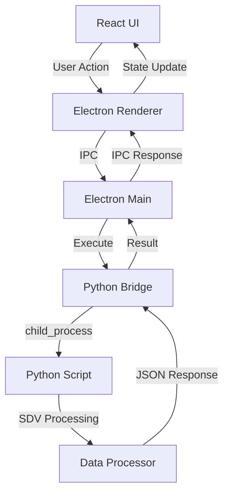

# SynthGen - Synthetic Data Generator


[](https://python.org)
[](https://electronjs.org)
[](https://reactjs.org)
[](https://github.com/sdv-dev/SDV)

SynthGen is a comprehensive Electron-based desktop application that generates high-quality synthetic data using the **Synthetic Data Vault (SDV)** library. It provides a user-friendly interface for data scientists, researchers, and developers to create privacy-preserving synthetic datasets that maintain the statistical properties and relationships of their original data.

## 🌟 Key Features

- **Multi-Format Support**: Handles CSV files with automatic delimiter detection
- **Dual Synthesis Modes**: Single-table (Gaussian Copula) and multi-table (HMA) synthesis
- **Auto-Metadata Detection**: Intelligent column type and relationship detection
- **Advanced Quality Assessment**: Comprehensive quality metrics, privacy evaluation, and SDV diagnostics
- **Data Visualization**: Real vs synthetic data comparison charts with column-level analysis
- **Export Flexibility**: Download synthetic data as CSV/ZIP or detailed quality reports as JSON
- **Interactive Quality Metrics**: Contextual tooltips and detailed explanations for all scores
- **Privacy-First**: Generate synthetic data without exposing original sensitive information
- **Cross-Platform**: Desktop application for Windows, macOS, and Linux

## 📋 Table of Contents

- [Installation](#-installation)
- [Quick Start](#-quick-start)
- [How It Works](#-how-it-works)
- [SDV Integration](#-sdv-integration)
- [Python Architecture](#-python-architecture)
- [User Interface Guide](#-user-interface-guide)
- [Technical Architecture](#-technical-architecture)
- [Configuration](#-configuration)
- [Development](#-development)
- [Troubleshooting](#-troubleshooting)
- [Contributing](#-contributing)

## 🚀 Installation

### Prerequisites

- **Node.js** 18+ and npm
- **Python** 3.10+ 
- **Git**

### Quick Setup

1. **Clone the repository**
   ```bash
   git clone https://github.com/your-username/synthgen.git
   cd synthgen
   ```

2. **Install Node.js dependencies**
   ```bash
   npm install
   ```

3. **Setup Python environment and SDV**
   ```bash
   npm run setup-python
   ```
   This installs:
   - SDV (Synthetic Data Vault) library
   - pandas, numpy, matplotlib, seaborn
   - Required Python dependencies

4. **Launch the application**
   ```bash
   npm start
   ```

### Development Mode

For development with hot reload:
```bash
npm run electron-dev
```

## 🏃 Quick Start

1. **Launch SynthGen** - Run `npm start`
2. **Select Files** - Choose your CSV file(s) or browse entire folders
3. **Review Data** - Check auto-detected column types and structure
4. **Map Relationships** - Define foreign key relationships (multi-table only)
5. **Generate Synthetic Data** - Configure parameters and create synthetic datasets
6. **Quality Assessment** - Review quality scores and download results

### Example Workflow

```
fruit.csv (original) → Analysis → Synthesis → Quality Report → synthetic_fruit.csv
```

## 🔧 How It Works

SynthGen follows a structured 5-step process based on SDV best practices:

### 1. **Data Preparation**
- Automatic CSV delimiter detection (`,`, `;`, `\t`, etc.)
- Column type inference (numerical, categorical, datetime)
- Data quality validation and preprocessing

### 2. **Metadata Detection**
- **Single Table**: Uses `SingleTableMetadata` for column specifications
- **Multi Table**: Employs `MultiTableMetadata` with relationship mapping
- Auto-detects primary keys, foreign keys, and data types

### 3. **Model Training**
- **Gaussian Copula**: For single tables with mixed data types
- **HMA (Hierarchical Multi-table Algorithm)**: For related tables
- Preserves statistical distributions and correlations

### 4. **Synthetic Generation**
- Generates statistically similar synthetic records
- Maintains referential integrity in multi-table scenarios
- Configurable record count and sampling parameters

### 5. **Quality Evaluation**
- Statistical fidelity scoring
- Privacy protection assessment
- Utility metrics for downstream applications

## 📊 SDV Integration

SynthGen leverages the [Synthetic Data Vault (SDV)](https://github.com/sdv-dev/SDV) library, a comprehensive framework for generating synthetic data.

### Synthesis Modes

#### **Single Table Mode - Gaussian Copula**
```python
from sdv.single_table import GaussianCopulaSynthesizer

# Best for:
- Mixed data types (numerical + categorical)
- Complex correlation patterns
- Single CSV files
- Quick prototyping
```

**Use Cases**: Customer data, financial records, survey responses

#### **Multi Table Mode - HMA (Hierarchical Multi-table Algorithm)**
```python
from sdv.multi_table import HMASynthesizer

# Best for:
- Related tables with foreign key relationships
- Database schemas
- Referential integrity requirements
- Complex data ecosystems
```

**Use Cases**: E-commerce databases, CRM systems, medical records

### SDV Algorithm Selection

| Algorithm | Best For | Strengths | Considerations |
|-----------|----------|-----------|----------------|
| **Gaussian Copula** | Mixed data types | Fast, handles correlations well | May struggle with complex distributions |
| **CTGAN** | Deep learning approach | Excellent for tabular data | Requires more computational resources |
| **TVAE** | Variational autoencoder | Good with categorical data | Training time varies |

## 🐍 Python Architecture

SynthGen uses a hybrid architecture where Python handles data processing and Node.js manages the UI and application lifecycle.

### Python Integration Method

```javascript
// Bridge Architecture
Electron Main Process ↔ pythonBridge.js ↔ child_process.execFile ↔ Python Scripts
```

### Key Python Components

#### **DataProcessor Class** (`python/data_processor.py`)
```python
class DataProcessor:
    def __init__(self):
        self.tables = {}
        self.metadata = None
        self.synthesizer = None
        self.file_delimiters = {}  # Delimiter tracking
```

**Core Methods**:
- `load_csv()` - CSV loading with delimiter detection
- `analyze_data()` - Structure analysis and metadata detection
- `detect_metadata()` - Auto-detection of column types and relationships
- `generate_synthetic_data()` - SDV-based synthesis
- `evaluate_quality_with_data()` - Quality assessment using SDV metrics

#### **Python Execution Strategy**
```javascript
// Reliable execution via child_process.execFile
const execFile = util.promisify(cp.execFile);
execFile(pythonExecutable, ['-c', script])
  .then(({ stdout, stderr }) => {
    // Parse JSON results from Python
    const result = JSON.parse(stdout);
    resolve(result);
  });
```

**Benefits**:
- ✅ No hanging processes (vs. python-shell)
- ✅ Timeout protection
- ✅ Better error handling
- ✅ JSON serialization with NumPy type conversion

### Python Environment

SynthGen bundles Python 3.10.18 using [python-build-standalone](https://github.com/indygreg/python-build-standalone) for consistent cross-platform execution.

**Bundle Location**:
```
app/
├── python/
│   ├── bin/python3.10          # Bundled Python executable
│   ├── lib/python3.10/         # Python standard library
│   └── site-packages/          # SDV and dependencies
```

## 🎨 User Interface Guide

### Main Interface Components

#### **Sidebar Navigation**
- **Select Files**: File picker and folder browser
- **Data Overview**: Structure analysis and column details
- **Map Relationships**: Foreign key definition (multi-table)
- **Generate Data**: Synthesis configuration and execution
- **Quality Report**: Assessment metrics and downloads

#### **Step-by-Step Workflow**

1. **File Selection**
   ```
   Supported: .csv files
   Features: Drag & drop, folder browsing, multi-selection
   ```

2. **Data Overview**
   ```
   Displays: Column types, sample data, null counts, unique values
   Auto-detects: Delimiters, data types, potential relationships
   ```

3. **Relationship Mapping** (Multi-table only)
   ```
   Define: Parent-child relationships
   Specify: Foreign key columns
   Validate: Referential integrity
   ```

4. **Synthesis Panel**
   ```
   Configure: Record count, algorithm selection
   Monitor: Real-time progress tracking
   Preview: Generation parameters
   ```

5. **Quality Report**
   ```
   Metrics: Statistical fidelity, privacy protection, utility scores
   SDV Diagnostics: Data validity and structure analysis with column-level details
   Visualization: Real vs synthetic data comparison charts
   Interactive Help: Click info icons for detailed metric explanations
   Downloads: Synthetic dataset (CSV/ZIP), quality report (JSON)
   ```

## 🏗️ Technical Architecture

### Application Stack

```
┌─────────────────────────────────────────┐
│              Electron App               │
├─────────────────────────────────────────┤
│  React Frontend (Material-UI)          │
│  - Components (FileSelector, etc.)     │
│  - State Management (useState/hooks)   │
├─────────────────────────────────────────┤
│  Electron Main Process                 │
│  - IPC Handlers                        │
│  - Python Bridge Integration           │
│  - File System Operations              │
├─────────────────────────────────────────┤
│  Python Backend                        │
│  - SDV Library Integration             │
│  - Data Processing Engine              │
│  - Quality Evaluation                  │
└─────────────────────────────────────────┘
```

### Key Files Structure

```
synthgen/
├── public/
│   ├── main.js              # Electron main process
│   ├── pythonBridge.js      # Python communication layer
│   └── index.html           # HTML entry point
├── src/
│   ├── App.js               # Main React component
│   ├── components/          # UI components
│   │   ├── FileSelector.js
│   │   ├── DataOverview.js
│   │   ├── ColumnMapper.js
│   │   ├── SynthesisPanel.js
│   │   └── QualityReport.js
│   └── utils/
├── python/
│   ├── data_processor.py    # Core data processing
│   └── setup.py            # Environment setup
├── package.json            # Node.js dependencies
└── CLAUDE.md              # Development instructions
```

### Communication Flow



## ⚙️ Configuration

### Environment Variables

```bash
# Python executable path (auto-detected)
PYTHON_EXECUTABLE=/path/to/python3.10

# Development mode
ELECTRON_IS_DEV=true

# Python bundle path
PYTHON_BUNDLE_PATH=./python/bin/python3.10
```

### Synthesis Parameters

```javascript
// Default generation parameters
{
  numRows: null,           // Use original dataset size
  algorithm: 'GaussianCopula',  // Default algorithm
  preserveRelationships: true,  // Maintain FK constraints
  timeout: 60000          // 60 second timeout
}
```

### Quality Evaluation Settings

```python
# SDV quality evaluation
evaluate_quality(
    real_data=original_data,
    synthetic_data=generated_data,
    metadata=detected_metadata,
    verbose=False  # Suppress progress output
)
```

## 💻 Development

### Development Commands

```bash
# Install dependencies
npm install
npm run setup-python

# Development mode (hot reload)
npm run electron-dev

# Production build and start
npm run build
npm start

# Package for distribution
npm run electron-pack

# Run tests
npm test

# Build only (without starting)
npm run build

# Start without building
npx electron .
```

### Adding New Synthesis Algorithms

1. **Update DataProcessor** (`python/data_processor.py`)
   ```python
   def generate_synthetic_data(self, algorithm='GaussianCopula'):
       if algorithm == 'NewAlgorithm':
           self.synthesizer = NewAlgorithmSynthesizer(self.metadata)
   ```

2. **Update UI Options** (`src/components/SynthesisPanel.js`)
   ```javascript
   <MenuItem value="NewAlgorithm">New Algorithm</MenuItem>
   ```

### Custom Metadata Detection

```python
def detect_custom_metadata(self, df):
    """Add custom column type detection logic"""
    # Implement custom detection rules
    return metadata_dict
```

## 🔧 Troubleshooting

### Common Issues

#### **Python Setup Errors**
```bash
# Verify Python installation
python3 --version

# Manual SDV installation
pip install sdv pandas numpy

# Check Python path
which python3
```

#### **Electron Build Issues**
```bash
# Clear cache and rebuild
rm -rf node_modules
npm install
npm run build
```

#### **CSV Parsing Errors**
- Ensure proper encoding (UTF-8)
- Check for malformed CSV structure
- Verify delimiter detection

#### **Synthesis Failures**
- Check data quality (missing values, inconsistent types)
- Ensure sufficient memory for large datasets
- Verify metadata detection accuracy

### Debug Mode

Enable verbose logging:
```javascript
// In main.js
console.log('Python setup result:', pythonResult);
console.log('Data analysis:', analysisResult);
```

### Performance Optimization

- **Large Datasets**: Consider sampling for initial analysis
- **Memory Usage**: Monitor Python process memory consumption
- **Processing Time**: Use progress callbacks for user feedback

## 🤝 Contributing

We welcome contributions! Please see our contributing guidelines:

1. **Fork the repository**
2. **Create a feature branch**: `git checkout -b feature/new-algorithm`
3. **Make changes**: Follow coding standards
4. **Add tests**: Ensure functionality works
5. **Submit PR**: Include detailed description

### Development Guidelines

- **Code Style**: Use ESLint for JavaScript, PEP 8 for Python
- **Testing**: Add unit tests for new features
- **Documentation**: Update README for significant changes
- **Dependencies**: Minimize new dependencies, prefer established libraries

## 📄 License

This project is licensed under the ISC License - see the [LICENSE](LICENSE) file for details.

## 🙏 Acknowledgments

- **[SDV Team](https://github.com/sdv-dev/SDV)** - Synthetic Data Vault library
- **[Electron](https://electronjs.org)** - Cross-platform desktop app framework
- **[React](https://reactjs.org)** - User interface library
- **[Material-UI](https://mui.com)** - React component library

---

## 📞 Support

For questions, issues, or feature requests:

- **GitHub Issues**: [Create an issue](https://github.com/your-username/synthgen/issues)
- **Documentation**: Check this README and `CLAUDE.md`
- **SDV Documentation**: [SDV Docs](https://docs.sdv.dev)

---

**Built with ❤️ for privacy-preserving synthetic data generation**